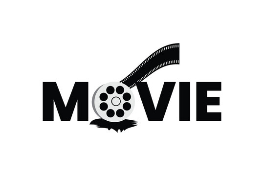
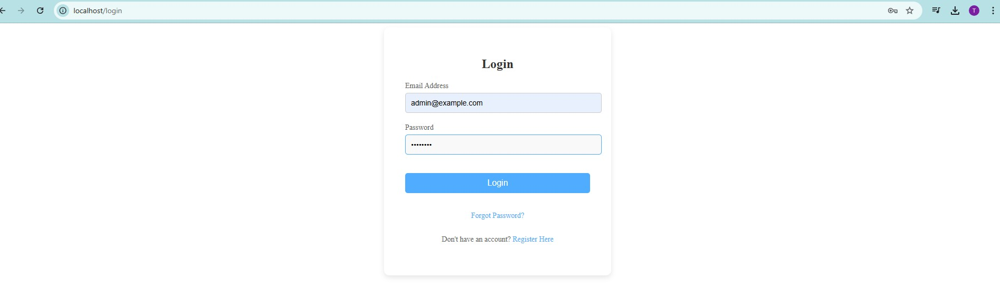
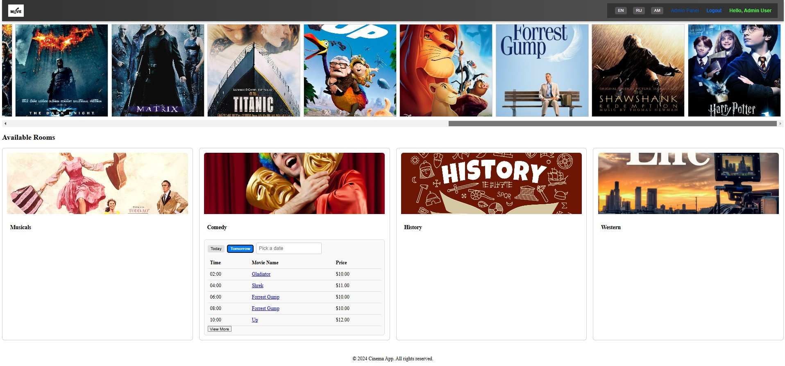
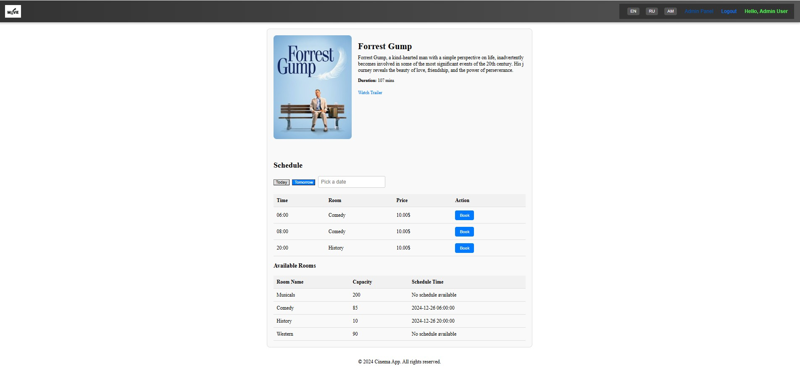
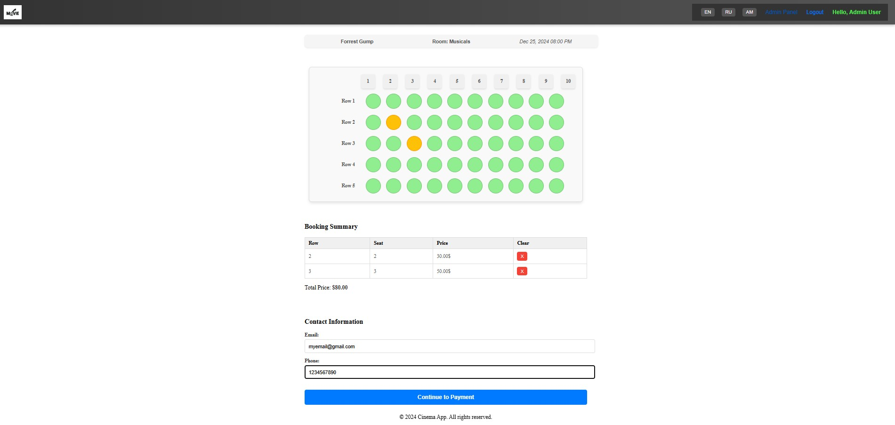
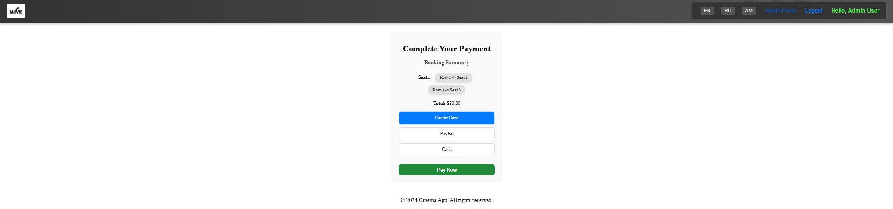
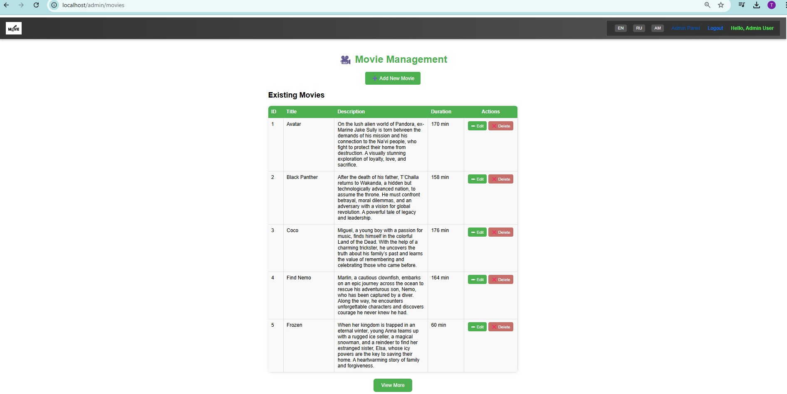

# 🎬 Cinema App




The **Cinema App** is a **web application** built with the **Laravel framework**, designed to simplify **movie ticket booking** and management.

---

It provides users with an intuitive experience to browse movies, view showtimes, and book seats. Admin users benefit from advanced tools to efficiently manage movies, showtimes, and user bookings.

---

# Table of Contents

0. [Quick Start](#quick-start)
1. [Features](#features)
2. [How the App Works](#how-the-app-works)
   - [Login and Registration](#login-and-registration)
   - [Movie Browsing](#movie-browsing)
   - [Admin Panel (Movie Management)](#admin-panel-movie-management)
   - [Booking Seats (steps)](#booking-seats-steps)
3. [Demo and Media](#demo-and-media)
4. [Installation (locally)](#installation-locally)
   - [Using Laravel Sail (Dockerized)](#using-laravel-sail-dockerized)
   - [Manual Setup (Without Sail)](#manual-setup-without-sail)
5. [Dependencies](#dependencies)
6. [Directory Structure](#directory-structure)
7. [Contributing](#contributing)
8. [Roadmap](#roadmap)
9. [External Resources](#external-resources)
10. [Acknowledgments & Credits](#acknowledgments-and-credits)
11. [Contact](#contact)
12. [License](#license)

---

## Quick Start

1. **Clone the repository**:
   ```bash
   git clone https://github.com/Nareeek/cinema-app.git
   cd cinema-app
   ```

2. **Install dependencies**:
   ```bash
   composer install
   npm install
   ```

3. **Set up `.env` file**:
   ```bash
   cp .env.example .env
   ```

4. **Run migrations**:
   ```bash
   php artisan migrate --seed
   ```

5. **Start the development server**:
   ```bash
   php artisan serve
   ```

6. **Access the app in your browser**:
   ```
   http://127.0.0.1:8000
   ```

For detailed installation instructions, see the [Installation](#installation) section.

---

[⬆ Back to Top](#table-of-contents)

---

## Features

- **User Authentication**: Sign up, log in, and booking your seats.
- **Browse Movies**: View movie details such as title, description, showtimes, and trailers.
- **Book Tickets**: Select showtimes, choose seats, and confirm bookings.
- **Admin Panel**: Only admin users can manage movies.

---

## How the App Works
### Login and Registration

- **Register** to create an account.
- **Log in** to access features like booking tickets.
- **Admin Role**: Admin users have additional permissions to access the admin panel.

### Movie Browsing

- **Homepage**: Displays a list of movies with showtimes and trailers.
    - The film can also be found in the **Rooms** section below.
- **Details Page**: Displays full movie details, including available showtimes.
    - We can **book** seats from here.

### Admin Panel (Movie Management)
⚙️ **Admin Features**:

- Accessible only to **admin users**.
- **Features**:
  - Add, edit, and delete movies.

### Booking Seats (steps)

- **Select Showtimes**: Choose a movie and a showtime.
    - Either select a movie from the **slideshow** (by clicking on it).
    - Or from the **Rooms** section (with desired date).
- **Seat Selection**: View and select available seats in a theater layout.
- **Booking Confirmation**: Confirm the booking and receive a unique booking reference (QR).

---

[⬆ Back to Top](#table-of-contents)

---

## Demo and Media

<details open>
  <summary><strong>🎥 Demo Video</strong></summary>
  <p align="center">
    <video width="700" controls>
      <source src="./assets/videos/demo.mp4" type="video/mp4">
      Your browser does not support the video tag.
    </video>
  </p>
</details>

---

## 📸 **Screenshots**:  

<details open>
  <summary><strong>Login Page</strong></summary>
  
</details>

<details>
  <summary><strong>Movie Browsing</strong></summary>
  
</details>

<details>
  <summary><strong>Movie Details Page</strong></summary>
  
</details>

<details>
  <summary><strong>Booking Page</strong></summary>
  
</details>

<details>
  <summary><strong>Booking Confirmation Page</strong></summary>
  
</details>

<details open>
  <summary><strong>Admin Panel</strong></summary>
  
</details>

---

[⬆ Back to Top](#table-of-contents)

---

# Installation (locally)

## Using Laravel Sail (**Dockerized**)
1. **Pre-Requisites**:
   - Install **Docker Desktop** (Windows/Mac) or **Docker Engine** (Linux).
   - For Windows: Install **WSL2** with an Ubuntu distribution.
   - Install Composer globally: [Get Composer](https://getcomposer.org/).

2. **Clone the repository**:
   ```bash
   git clone https://github.com/Nareeek/cinema-app.git
   cd cinema-app
   ```

3. **Install Sail**:
   ```bash
   composer require laravel/sail --dev
   ```

4. **Set up environment variables**:
   - Copy `.env.example` to `.env`.
   - Update database credentials:
     ```env
     DB_CONNECTION=mysql
     DB_HOST=mysql
     DB_DATABASE=cinema_db
     DB_USERNAME=sail
     DB_PASSWORD=password
     ```

5. **Start Sail**:
   ```bash
   ./vendor/bin/sail up
   ```

6. **Run migrations and seeders**:
   ```bash
   ./vendor/bin/sail artisan migrate --seed
   ```

7. **Access the app**:
   Visit `http://localhost` in your browser.

--- 

## Manual Setup (**Without Sail**)
1. 🛠️ **Prerequisites**:

- Tools to install:

| Tool         | Version       | Installation Link                           |
|--------------|---------------|---------------------------------------------|
| **PHP**      | >= 8.1        | [PHP Official Site](https://www.php.net/)  |
| **Composer** | Latest        | [Get Composer](https://getcomposer.org/)   |
| **MySQL**    | Latest        | [MySQL](https://www.mysql.com/)            |
| **Node.js**  | Latest (LTS)  | [Node.js](https://nodejs.org/)             |
| **Docker**   | Latest        | [Docker](https://www.docker.com/)          |

- Set up a local web server (e.g., Apache, Nginx).


2. **Clone the repository**:
   ```bash
   git clone https://github.com/Nareeek/cinema-app.git
   cd cinema-app
   ```

3. **Set up environment variables**:
   - Copy `.env.example` to `.env`.
   - Update database credentials.

4. **Install dependencies**:
   ```bash
   composer install
   npm install
   ```

5. **Run migrations and seeders**:
   ```bash
   php artisan migrate --seed
   ```

6. **Start the development server**:
   ```bash
   php artisan serve
   ```

7. **Compile assets**:
   ```bash
   npm run dev
   ```

8. **Access the app**:
   Visit `http://127.0.0.1:8000`.

---

[⬆ Back to Top](#table-of-contents)

---

## Dependencies
📦 **Required Tools**:

- **PHP** (>= 8.1)
- **Composer**: PHP dependency manager.
- **Node.js**: For managing front-end assets.
- **MySQL**: Database for storing app data.
- **Vite**: Modern front-end tooling for Laravel.
- **Docker/Sail**: Optional Dockerized environment.

---

## Directory Structure

```
cinema-app/
├── app/                 # Application source code
├── database/            # Migrations, seeders, and factories
├── public/              # Public assets (e.g., index.php, CSS, JS)
├── resources/           # Blade templates and frontend assets
├── routes/              # Web and API routes
├── storage/             # Logs and cached files
├── tests/               # Automated tests
├── .env                 # Environment configuration
├── composer.json        # PHP dependencies
└── README.md            # Project documentation
```

---

## Roadmap

- [x] User Authentication (Login/Registration)
- [x] Movie Browsing and Booking
- [x] Admin Panel for Managing Movies
- [ ] Admin Panel for Managing Schedules (for each room) and reservations (seats).
- [ ] Add Payment Integration
- [ ] Improve Mobile Responsiveness
- [ ] Add Multi-Language Support

---

[⬆ Back to Top](#table-of-contents)

---

## External Resources

- [Laravel Framework Documentation](https://laravel.com/docs)
- [Composer Official Documentation](https://getcomposer.org/doc/)
- [Docker Documentation](https://docs.docker.com/)
- [Vite Documentation](https://vitejs.dev/)

---

## Contributing

🤝 We welcome contributions from the community! Here's how you can get started:

1. **Fork the Repository**: Click the "Fork" button at the top of this page.

2. **Clone the Repository**: Use the command:
   ```bash
   git clone https://github.com/your-username/cinema-app.git
   ```
3. **Create a Branch**: Create a new feature branch:
    git checkout -b feature/your-feature-name
4. **Commit Your Changes**: Make your changes and commit them:
    git commit -m "Add your feature"
5. **Push to Your Branch**:
    git push origin feature/your-feature-name
6. **Submit a Pull Request**: Open a pull request on the main repository.

---

## Acknowledgments and Credits

🙏 This project was made possible thanks to the tools, and resources listed below:

- **Framework**: Built using the powerful [Laravel Framework](https://laravel.com/).
- **Frontend Tooling**: Asset compilation powered by [Vite](https://vitejs.dev/).
- **Visuals & Media**: Images and assets sourced from [Unsplash](https://unsplash.com/).

If you'd like to contribute to future iterations of the Cinema App, feel free to check out the [Contributing](#contributing) section!


---

## Contact
- **GitHub**: https://github.com/Nareeek
- **Linkedin**: https://www.linkedin.com/in/narek-ikhtiaryan-5a3242160/
- **Email**: narek.ikhtiaryan.ni@gmail.com

---

## License

📜 This project is licensed under the **MIT License**. You are free to use, modify, and distribute this software. See the full license [here](./LICENSE).

---

[⬆ Back to Top](#table-of-contents)

---
